  <picture><source media="(prefers-color-scheme: light)" srcset="assets/hero-light.svg" /></picture>

  <picture><source media="(prefers-color-scheme: light)" srcset="assets/about-light.svg" /></picture>

  <picture><source media="(prefers-color-scheme: light)" srcset="assets/stack-light.svg" /></picture>

  <picture><source media="(prefers-color-scheme: light)" srcset="assets/heatmap-light.svg" /></picture>

  <picture><source media="(prefers-color-scheme: light)" srcset="assets/stats-light.svg" /></picture>

<h2 align="center">🤝 Connect With Me</h2>

  <a href="https://leetcode.com/u/neelavra_dutta/"><picture><source media="(prefers-color-scheme: light)" srcset="assets/chip-1-light.svg" /></picture></a>
  &nbsp;&nbsp;
  <a href="https://www.instagram.com/toeiooo.so/"><picture><source media="(prefers-color-scheme: light)" srcset="assets/chip-2-light.svg" /></picture></a>
  &nbsp;&nbsp;
  <a href="https://x.com/Neel_avra1"><picture><source media="(prefers-color-scheme: light)" srcset="assets/chip-3-light.svg" /></picture></a>

